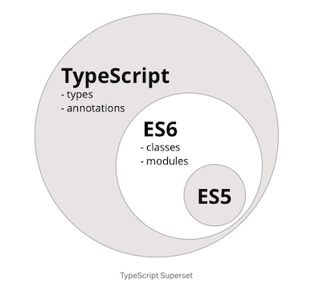
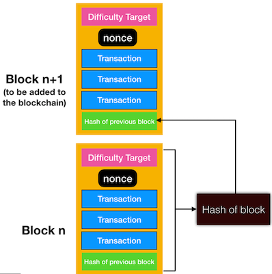

# Typechain

> This is just for studying typescript repo 😇

> Make blockchain with typescript 🧐

> with [Nomadcoders Typescript Course](https://nomadcoders.co/typescript-for-beginners/lobby)

<br />

<details>
<summary style='font-size:20px'>Log 📖 </summary>
<br/>
210806 README : 타입스크립트 간단 정리 마무리<br/>
210807 Project Complete<br/>
</details>
<br />

# Goals

- Learn about big picture of typescript 🔥

- Learn about syntax of typescript ✏️

- Learn about simple and rough blockchain mechanism using typescript 🚀

<br />

# What is Typescript?



타입스크립트는 자바스크립트의 `superset(확장판)` 이다. 좀 더 구체적이고 간단하게 말하면 자바스크립트에 타입을 부여한 언어이다.자바스크립트는 동적언어로서 런타임시기에 타입에 대한 검사를 한다. 그로 인해 타입 오류는 프로그램을 실행해보지 않고는 잡기가 힘들다. 또한 타입에 맞지않음에도 자바스크립트는 에러는 발생시키지않으면서 작동을 한다. (undefined, null 등으로 인한 에러) 이러한 에러를 타입을 부여함으로서 미연에 방지할 수 있게 된다. 이로 인해 코드의 품질과 개발의 생산성이 높아진다.

## Type

> syntax : 변수 다음에 : 을 찍고 그 뒤에 해당 타입을 적는다.

### String

```typescript
const name: string = 'jjanmo';
```

### Number

```typescript
let age: number = 25;
```

### Boolean

```typescript
let isMale: boolean = true;
```

### Array

```typescript
//1) 일반적인 방법
let hobbies: string[] = ['yoga', 'reading', 'game'];

//2)제네릭 배열 타입
let favNumbers: Array<number> = [7, 17, 77];
```

> 제네릭 배열 타입은 `Array<elemType>` 와 같은 형태로 적는 방식이다.

### Tuple

튜플은 요소의 타입과 개수가 고정된 배열로서 표현하는 타입을 말한다. 말로 들으면 약간 이해하기 어려울수도 있겠지만 코드로 보면 간단하다.

```typescript
let arr: [string, number, string] = ['hello', 7, 'world'];

arr[1].substring(1); // 'ello'

arr[4] = 'happy coding'; // error
```

> 코드에서 보면 arr은 항상 문자열, 숫자, 문자열 타입의 개수가 3개인 배열로 고정되어 있다. 그래서 arr[1]은 문자열이기 때문에 접근해서 문자열 메소드를 사용할 수 있지만, arr[4]는 애초에 배열의 개수와 타입이 정해졌기 때문에 접근조차 할 수 없다.

### Enum

이넘은 C나 자바에서 사용되는 타입으로 특정 값들의 집합을 의미한다.

```typescript
enum Languages {
  Typescript,
  Javascript,
  Python,
}

let lang1: Languages = Languages.Javascript;
console.log(lang1); //1

let lang2: Languages = Languages[2];
console.log(lang2); //Python
```

> 이넘은 0부터 시작해서 멤버에 번호(인덱스)를 매긴다. `Typescript, Javascript, Python,`는 `0,1,2` 순으로 값을 갖게 된다. 이 값은 수동으로 바꿀 수 있다. 또한 값(인덱스)을 통해서 접근할 수도 있다.

### Any

알지 못하는 타입을 표현해야하는 경우 사용한다. 이렇게 적으면 해당 변수는 타입 검사를 하지 않고 넘어간다.

```typescript
let uncertainty: any = 10;

uncertainty = 'I dont know';

uncertainty = true;
```

> 위의 코드처럼 타입이 정해져 있지 않기때문에 동적으로 다른 타입을 할당 할 수 있다.

```typescript
const arr: any[] = ['10', 7, 'impossible', false];
```

> 전체의 타입을 정확히 알지 못하는 경우 any를 사용한다.(ex. 여러 타입이 섞여 있는 배열)

### Undefined & Null

각자의 이름으로 타입을 갖는다. 자바스크립트에서 알고 있는 undefined와 null 타입과 같다. 타입스크립트에서 이 자체로 특별하게 사용하는 경우는 거의 없다고한다.

### Void

어떤 타입도 존재할 수 없음을 나타낸다. 일반적으로 함수에서 `void` 라고 쓰면 반환하는 것이 아무것도 없음을 뜻한다.

```typescript
const blockchain: Block[] = []; //Block은 클래스(객체)

//1) function declaration
function addBlock(block: Block): void {
  blockchain.push(block);
}

//2) arrow function
const logHash = (block: Block): void => console.log(block.hash);
```

### Never

절대 발생할 수 없는 타입을 말한다. 항상 오류를 발생시키거나 절대 반환하지 않는 반환 타입으로 사용된다.

> 이 부분은 아직 경험이 부족해서 그런지 어떤 경우에 사용해야하는지 감이 오지 않는다... 😱

```typescript
function infiniteLoop(): never {
  while (true) {}
}
```

### Object

객체 타입은 원시타입(number, string, boolean, null, undefined, symbol, bigint)이 아닌 나머지를 나타낸다.

```typescript
const getHashForBlock = (block: Block): string =>
  Block.calculateHash(block.index, block.previousHash, block.timestamp, block.data);
```

> Block 이라는 객체 타입을 사용한다.

<br />

## Interface

```typescript
interface Block {
  index: number;
  hash: string;
  previousHash: string | null;
  data: string;
  timestamp: Date;
}

class BlockImpl implements Block {
  // 인터페이스를 구현한 클래스
}
```

지금 만들어놓은 코드를 다시 보니, 인터페이스보다 타입(type aliases)을 만들어서 사용하는 편이 좋은 것 같다. 블록체인이 마치 연결리스트와 같은 형태로 되어 있기때문에 그 안에 블럭이라는 타입을 이어서 블럭체인을 만든다라고 생각하면 좋았을거 같다.

어쨌든, 실제 예제에선 인터페이스를 사용하지 않았다. 인터페이스와 타입은 상당히 유사해보이지만, 사용 방법에서 차이가 있다. 타입은 말그대로 어떤 데이터 (뭉치)의 타입을 설정하는 것이다. 그렇기 때문에 값에 더 초점이 맞춰서 있다. 이와는 다르게, 인터페이스는 일정 규격을 설정하는 설계도이다. 그렇기 때문에 인터페이스를 구현하는 클래스는 인터페이스에서 알려주는 설계도에 있는 내용은 반드시 구현해야한다. 즉 타입과는 다르게 큰 틀을 제시하게 된다.

<br />

## Class

> 클래스는 일반적으로 우리가 익히 들어왔던 클래스와 같다. 타입스크립트가 아니라도 이미 자바스크립트(ES6이상)에서도 클래스를 사용할 수 있기에 비슷한 느낌으로 접근할 수 있다. 기존 클래스에 타입이 더해졌다고 생각하면 된다.

> 타입스크립트에서만 사용할 수 있는 클래스의 문법(syntax)에 대해서 알아보자.

### constructor

```typescript
class Animal {
  // 1)
  public type: string;
  constructor(type: string) {
    this.type = type;
  }

  // 2)
  constructor(public type: string) {}
}
```

생성자라 함은 클래스를 통해서 새로운 객체(인스턴스)를 만들때(생성할 때), 처음으로 실행되는 함수(메소드)를 말한다. 다시 말하면, 생성자는 생성하는 객체를 초기화시켜주는 역할을 한다. 만약에 클래스 내부에 생성자가 없다면, 이는 생략된 것이며, 딱히 객체가 생성되는 시점에 초기화시켜줘야 할 로직이 없다는 것을 말한다.

생성자를 클래스에서 나타낼 수 있는 방법은 위처럼 두가지가 있다. 첫번째는 퍼블릭 필드 변수를 선언하고 생성자 안에서 해당 값을 초기화 시켜줄 수 있다. 퍼블릭은 접근 제한자로서 해당 변수에 접근 정도를 제어한다.

> 필드란, 영어의 뜻은 fence로 둘러쌓인 특정 공간이라는 의미에서 파생되어서 클래스로 둘러쌓인 공간에서 생성된 변수를 말한다. 그래서 퍼블릭 필드(public fields)란 외부에서도 접근이 가능한 클래스 내부에서 선언된 변수, 프라이빗 필드(private fields) 는 클래스 내부에서만 접근 가능한 클래스 내부에서 선언되 변수를 말한다. 그래서 이러한 필드를 멤버변수라고 부르기도 한다.

두번째는 첫번째의 코드를 한 줄로 줄일 수 있다. 생성자의 인자로서 접근 제한자와 변수를 선언하면 암묵적으로 변수를 초기화하게 된다.

### 접근 제한자

위에서 잠깐 언급했지만, 접근 제한자는 앞에서 말했듯이 해당 변수나 메소드에 접근 정도를 제어하기 위해서 사용한다. `public`, `private` 외에도 `protected` 라는 것도 있다. protected는 해당 변수나 메소드의 접근을 부모 클래스와 부모 클래스를 상속 받은 자식 클래스만 접근할 수 있도록 제한한다. `readonly` 는 말 그대로 읽기 전용이라는 의미로, 한 번 지정한 값이 변하면 안되는 경우 사용한다. readonly의 값은 필드 선언시(맨 위에서 변수를 선언할 때) 혹은 생성자 안에서만 이루어진다. 그 이후에는 오직 읽기만 가능한 상태가 된다. 그래서 readonly를 사용하는 경우는 상수값을 할당할 때 주로 사용한다. 참고로 네이밍 컨벤션은 주로 대문자로 표현한다.

### getter & setter

```typescript
type Status = 'Ready' | 'Doing' | 'Complete';

class ToDoItem {
  readonly index: number;
  constructor(private _title: string, public status: Status = 'Ready') {
    this.index = Math.floor((Math.random() * 10 + 1) * Date.now());
  }

  set title(title) {
    this._title = title;
  }

  get title() {
    return this._title;
  }
}

const todo = new ToDoItem('Study Typescript');
console.log(todo); // 1)

// todo._title = 'Play Game'; // 2)

todo.title = 'Play Game'; // 3)
console.log(todo);

todo.status = 'Complete'; // 4)
console.log(todo);
```

getter와 setter는 말 그대로의 값을 얻는 메소드, 값을 설정하는 메소드를 말한다. 그렇다면 왜 이런 것을 사용하는가? 이것은 접근 제한자인 private를 사용하게 되면 클래스 외부에서는 해당 프로퍼티에 접근이 불가능하다.(물론 메소드일 경우도 마찬가지!) 그래서 해당 프로퍼티를 외부에서 변경하거나 해당 값을 얻기 위해선 getter와 setter가 필요하다. 위 예제를 통해서 getter와 setter를 사용하는 방법에 대해서 알아보자.

1번의 결과값으론 아래와 같은 객체(인스턴스)를 얻을 수 있다.

```js
{
  "_title": "Study Typescript",
  "status": "Ready",
  "index": 15130692742890
}
```

그런데 todo의 타이틀을 바꾸기 위해서 2번 코드처럼 사용하면 에러가 발생한다. 왜냐하면 title은 private 접근 제한자이기 때문에 직접 접근해서 수정할 수 없기 때문이다. 그래서 클래스 내부에 `get` 이나 `set` 키워드를 사용해서 값을 얻는 메소드(getter), 값을 수정하는 메소드(setter)를 만들어야 한다. 그러면 이제 3번 코드처럼 직접 수정할 수 있다. 그런데 이 때 마치 타이틀에 직접 접근해서 고치는 것 같지만 내부적으론 getter과 setter을 만들어줬기 때문에 저렇게 사용할 수 있는 것이다. 아래 결과값처럼 변경된 것을 확인할 수 있다.

```js
{
  "_title": "Play Game",
  "status": "Ready",
  "index": 15130692742890
}
```

title과 다르게 status는 public 접근 제한자를 사용하기 때문에 4번처럼 status에 직접 접근해서 변경할 수 있다.

```js
{
  "_title": "Play Game",
  "status": "Complete",
  "index": 15130692742890
}
```

### static

```typescript
type Direction = 'up' | 'down' | 'left' | 'right';
type Location = {
  x: number;
  y: number;
};

class Character {
  static origin: Location = { x: 0, y: 0 };

  move(direction: Direction) {
    switch (direction) {
      case 'up': {
        Character.origin.y += 1;
        break;
      }
      case 'down': {
        Character.origin.y -= 1;
        break;
      }
      case 'left': {
        Character.origin.x -= 1;
        break;
      }
      case 'right': {
        Character.origin.x += 1;
        break;
      }
    }
  }
}

console.log(Character.origin); // 1)
const jjanmo = new Character();

jjanmo.move('left');
console.log(Character.origin); // 2)

jjanmo.move('up');
console.log(Character.origin); // 3)
```

일반적으로 클래스 내부에서 선언한 것들은 클래스를 통해서 만들어진 인스턴스 객체가 해당 프로퍼티나 메소드에 접근하여 사용한다. 참고로 일반적인 클래스 객체지향 언어(자바, C++ 등)과 다르게 프로토타입 바탕이기때문에 보여지는 것은 클래스지만 사실 내부적으로 프로토타입을 바탕으로 동작하고 있다는 사실을 알고 있어야 한다.

다시 static으로 돌아와서, 객체 인스턴스를 만들지 않고 클래스 차원에서 해당 프로퍼티나 메소드를 사용할 수 있게 만들어 주는 것이 `static` 이다. 이러한 예는 우리가 지금까지 거부감 없이 많이 사용했었다. 예를 들면 `Math.floor(...)`같은 것이 있다. 내가 Math의 객체 인스턴스를 만들지도 않았는데, Math 클래스에 접근해서 그 안에 있는 floor() 라는 메소드를 사용할 수 있었다. `Math.PI`도 있다. 파이 3.14의 상수값인데, 이 역시 클래스에서 접근하였다.

그런 비슷한 예를 위해서 코드를 만들어 보았다. 캐릭터의 움직임에 대한 것이다. origin 이라는 static 변수는 하나의 캐릭터당 한 개만 존재해야한다. 즉 하나의 인스턴스 객체는 하나의 움직이는 좌표를 갖는 것이다.

그럼 어떤 경우에 static을 사용할 수 있을까에 대한 생각을 할 수 있다. 이러한 생각을 위해서 아래 코드를 추가해보자.

```typescript
const michael = new Character();
michael.move('down');
console.log(Character.origin); // ?
```

코드를 실행하면, Character.origin의 값이 변경된 것을 확인 할 수 있을 것이다. 뭔가 이상하다. 왜냐하면 Character.origin의 값은 사실 jjanmo의 위치 값이라고 생각하고 설정했기때문이다. 그런데 michael이 움직이니까 jjanmo의 위치도 변하게 되는 창조(?) 움직임이 발생한 것이다. 결국 위 코드는 전체적으로 잘못된 코드였던 것이다. 😭 객체 인스턴스를 하나만 생성했을땐 마치 잘 작동할 것처럼 보였지만 여러 개를 만들기시작하면서 오류가 생긴다는 사실을 발견하였다. 여기서 static이라는 키워드를 어떻게 사용해야 할지 감을 잡을 수 있다. 유일한 것에 대한 프로퍼티나 메소드의 경우에 static을 사용할 수 있을 것이다. 또 의도적으로 특정 메소드를 사용하게 유도하기 위해서도 static을 사용한다. 나아가 효율적인 메모리 사용을 위해서 static을 사용하기도 한다.

<br />

## Blockchain Mechanism

> 이 프로젝트에서 타입스크립트를 통해서 간단한 블록체인을 구현하였다.

> `Block` 이라는 클래스를 통해서 객체(인스턴스)를 지속적으로 생성하여 연결하여 블록체인이 만들어지는 과정을 구현하였다.

> 아래 이미지는 블록체인의 큰 그림이다. 실제 구현한 큰 틀에서 봤을때는 마치 연결리스트와 비슷하다. 여기서는 세부적인 기능보다도 타입스크립트를 통해서 블록체인의 큰 그림을 구현하는데 초점을 맞추었다.



<br />

## Feedback

블록체인을 구현한 코드는 이 글을 쓰는 시점으로 부터 약 5개월 전에 구현한 코드이다. 여기서 구현한 <u>매우 매우 간단한 블록체인</u>인데, 지금 다시 보니 그냥 자바스크립트에 타입만 들어간 `짝퉁` 타입스크립트 코드라는 것에 매우 부끄러웠다. 이걸 타입스크립트라고 적어놓다니... 😭 😱 이러한 부끄러운 코드와 관계없이 타입스크립트를 다시 공부하고 있었다는 사실이 참 다행으로 여겨졌다. 처음에는 부끄러운 코드부터 시작하는거야 라는 나름의 합리화를 하며 점점 발전해나가야 하겠다. 🚀
